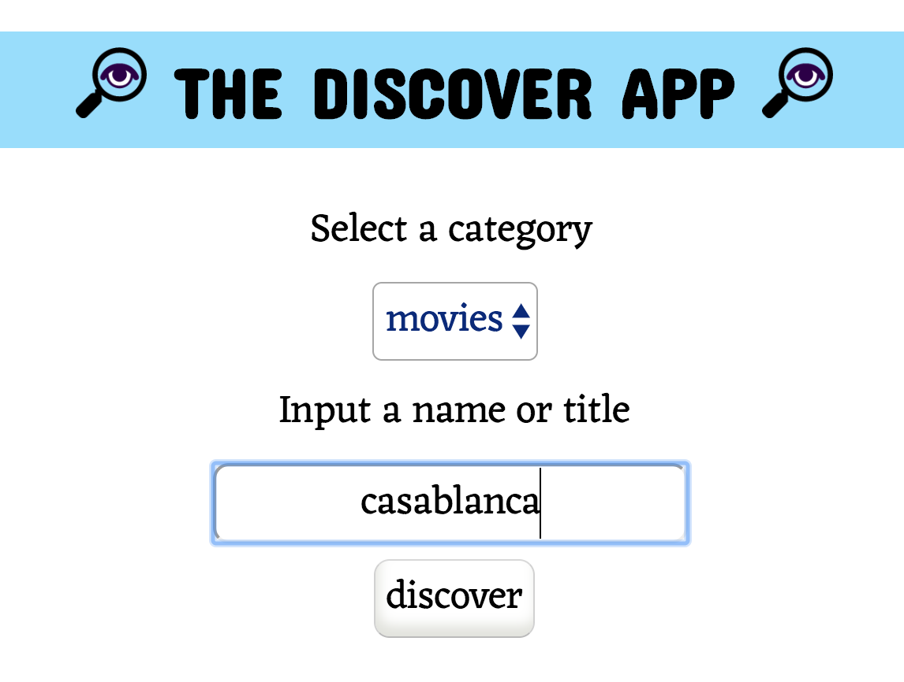
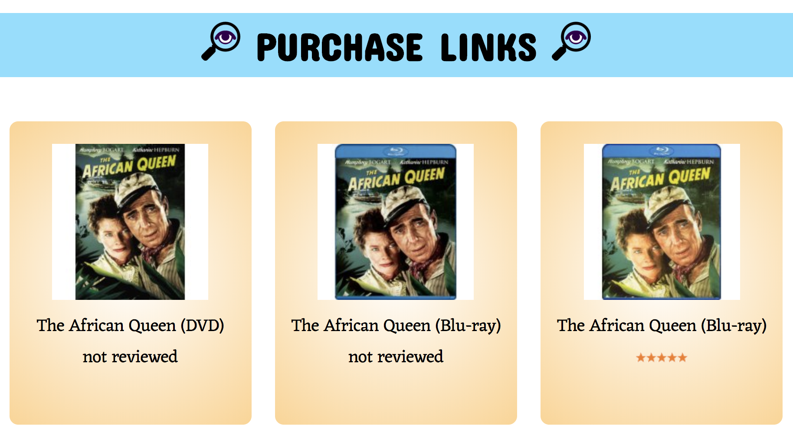

The Discover App

live link: https://devlevi.github.io/discover-api-capstone/

The Discover App helps the user locate  music, movies and books similar to those searched for.

Initially, the user lands on a splash screen view. By selecting the discover button, they move into the search-page-view of the app.

In the search page view the user selects a category and searches for the title or name of a book, movie or musical artist. When the discover button is selected, they are routed to the similar results view.

The user can browse through the the similar results and select any of the displayed options to be routed to the purchase links view.

The user can select one of the returned purchase link results to be directed to the item page on www.walmart.com

Technology used: HTML, CSS, JavaScript, jQuery
